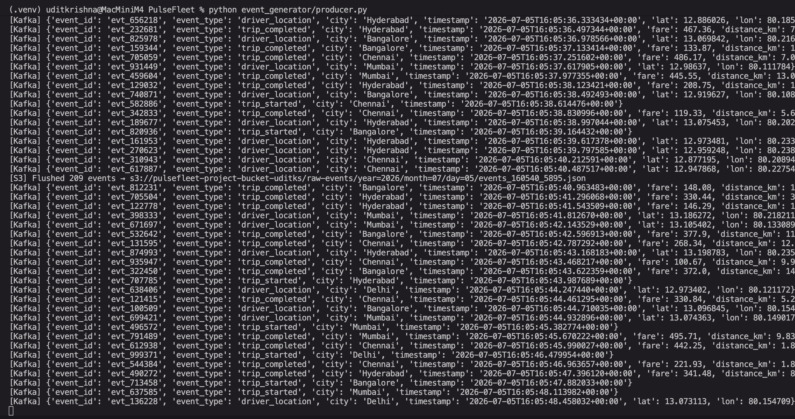
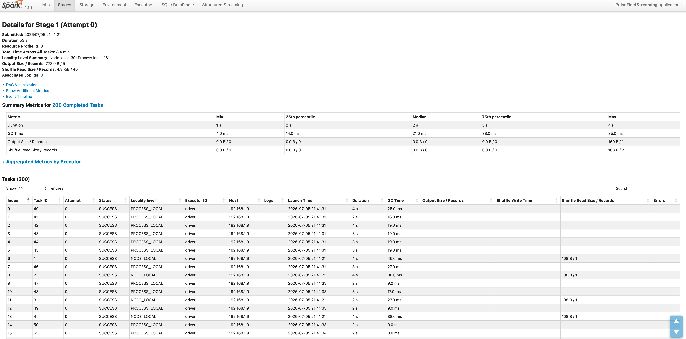
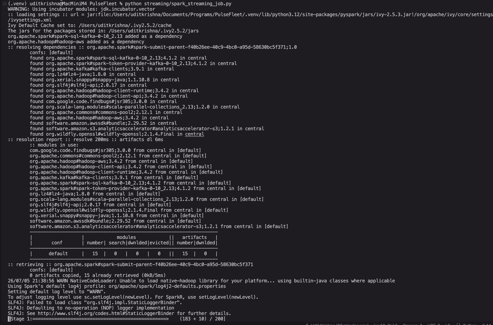
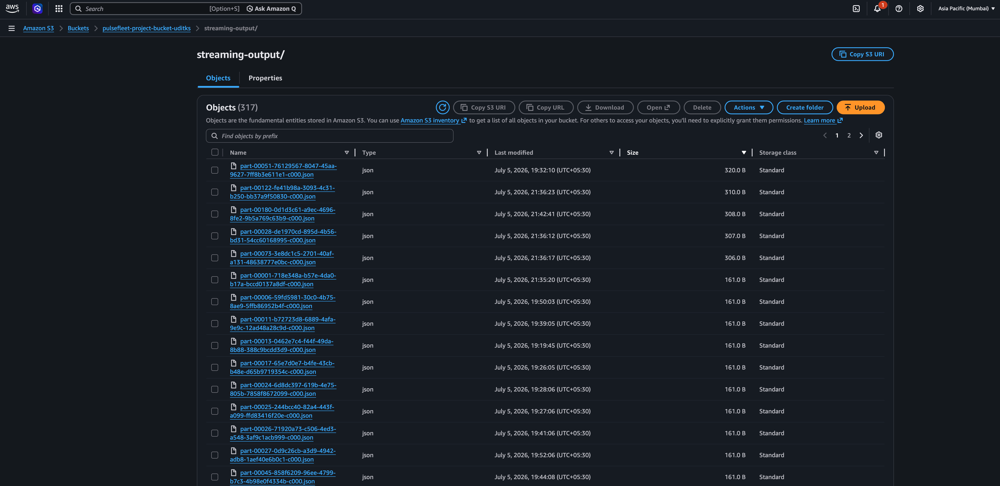
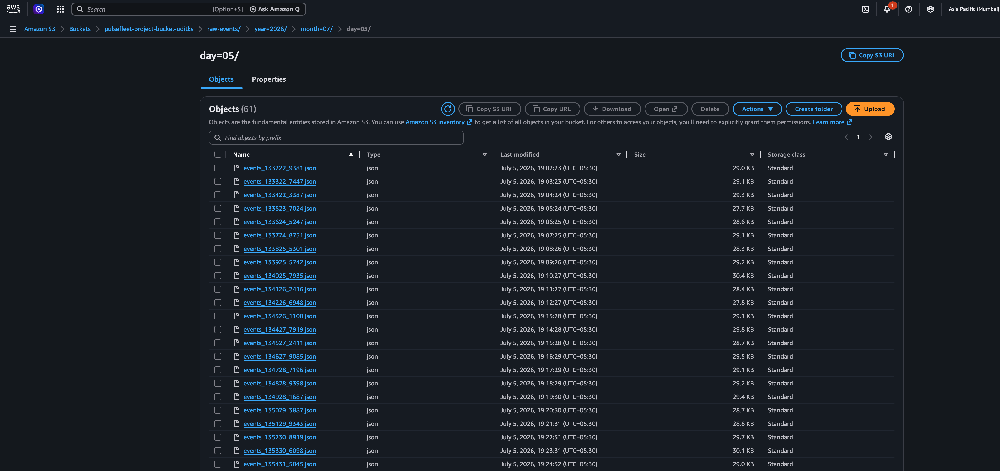
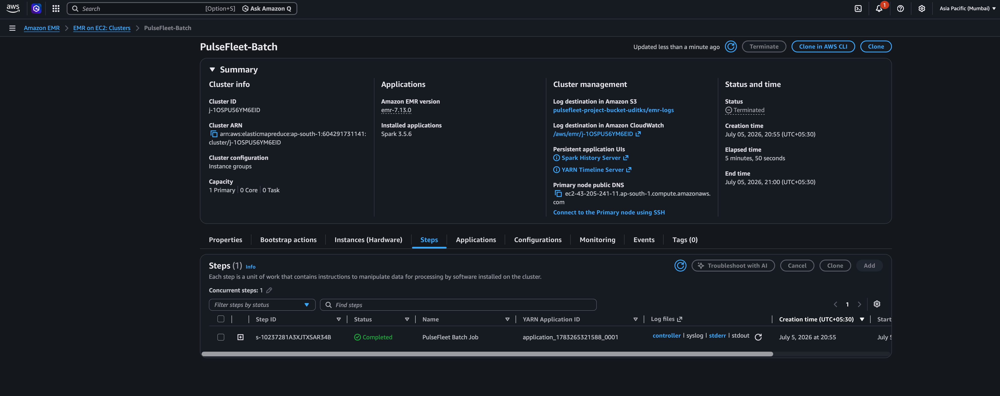
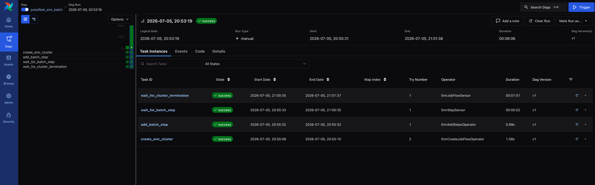
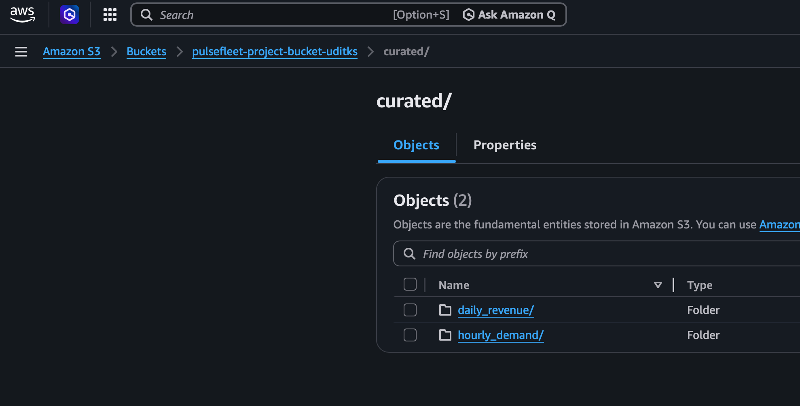

# Pipeline Demo

Evidence that the pipeline ran end-to-end.

---

## 1. Event Producer

Terminal output showing events being sent to Kafka and batches flushed to S3.

---

## 2. Spark Structured Streaming

Consuming events from the `ride-events` topic, processing windowed aggregates, and writing output to S3.

---

## 3. S3 — Raw Events Archive

S3 bucket showing the partitioned `raw-events/year=/month=/day=/` prefix written by the producer.

---

## 4. EMR Batch Job

EMR cluster in TERMINATED state with the Spark step marked as Completed.

---

## 5. Airflow DAG

DAG run with all tasks green — cluster creation, step submission, step sensor, and cluster termination.

---

## 6. S3 — Curated Output

Parquet files written to `curated/daily_revenue/` and `curated/hourly_demand/` after the batch job completed.

---

## 7. Sample Output

### daily_revenue

| trip_date  | city      | total_revenue | total_trips |
|------------|-----------|---------------|-------------|
| 2026-07-05 | Bangalore | 191109.88     | 678         |
| 2026-07-05 | Delhi     | 182604.36     | 675         |
| 2026-07-05 | Chennai   | 190140.87     | 696         |
| 2026-07-05 | Mumbai    | 204037.18     | 728         |
| 2026-07-05 | Hyderabad | 177548.05     | 650         |

### hourly_demand

| trip_date  | trip_hour | city      | trip_count |
|------------|-----------|-----------|------------|
| 2026-07-05 | 14        | Bangalore | 297        |
| 2026-07-05 | 14        | Mumbai    | 340        |
| 2026-07-05 | 13        | Chennai   | 363        |
| 2026-07-05 | 14        | Delhi     | 300        |
| 2026-07-05 | 13        | Bangalore | 381        |
| 2026-07-05 | 13        | Mumbai    | 388        |
| 2026-07-05 | 13        | Hyderabad | 357        |
| 2026-07-05 | 14        | Chennai   | 333        |
| 2026-07-05 | 14        | Hyderabad | 293        |
| 2026-07-05 | 13        | Delhi     | 375        |
